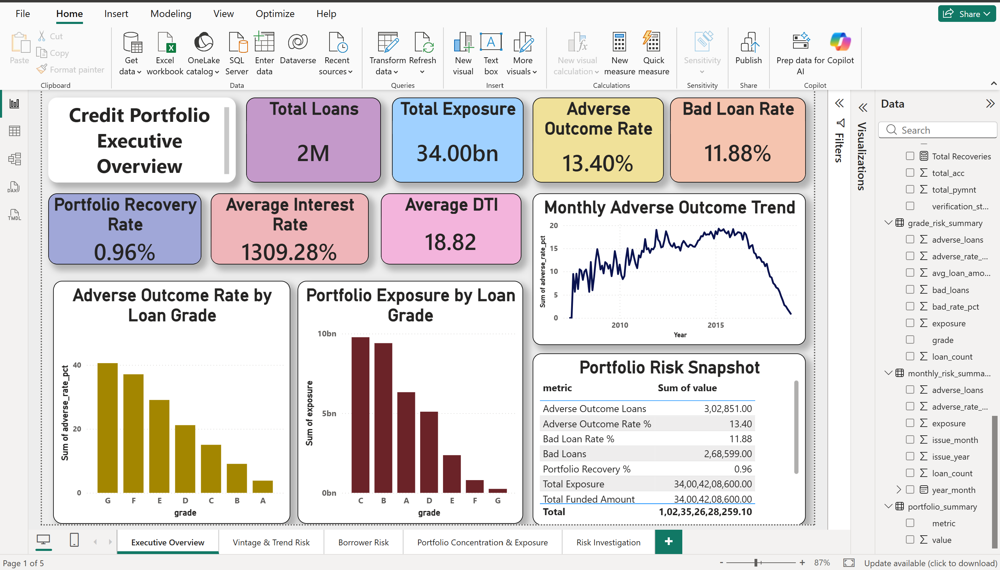
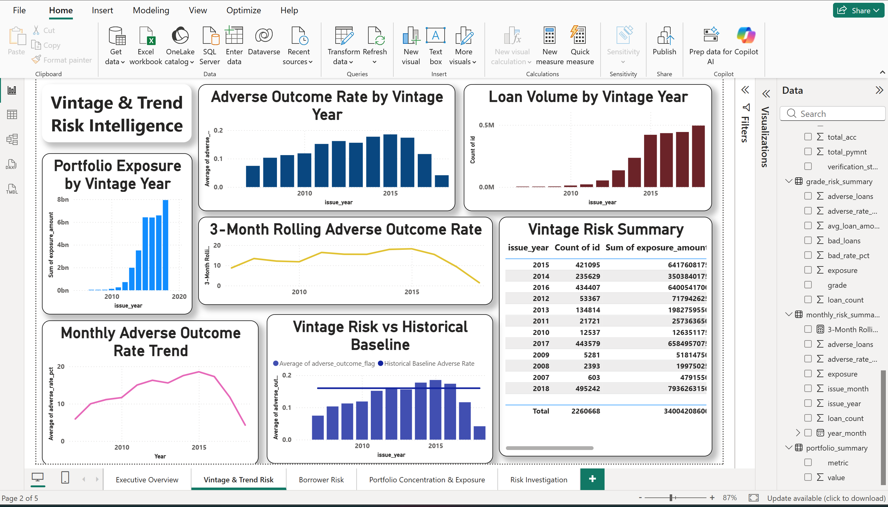
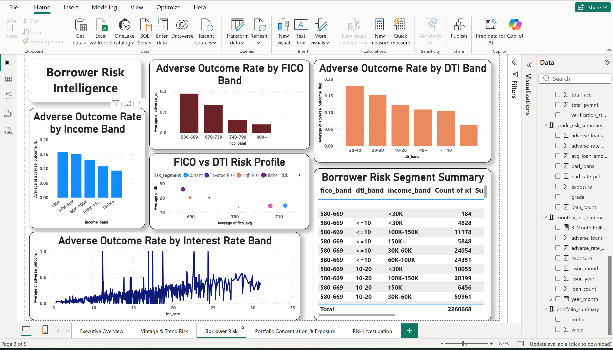
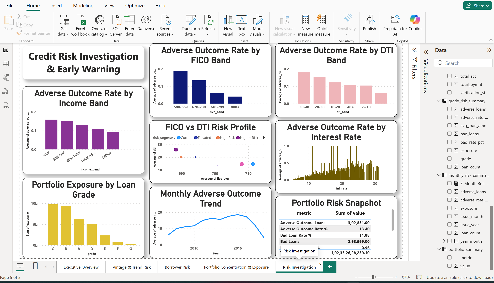

# Credit Portfolio Early-Warning & Risk Intelligence Platform

## 📌 Project Overview

Analyzed the public LendingClub Accepted Loans dataset (2007–2018 Q4) to understand credit portfolio risk, borrower characteristics, portfolio concentration, recovery performance, vintage trends, and observed adverse outcomes.

The project combines Python, SQL, and Power BI to build an end-to-end credit risk intelligence workflow.

## 🎯 Business Questions

- How large is the analyzed loan portfolio?
- What is the observed adverse outcome rate?
- How do outcomes vary across loan grades?
- How do FICO score, DTI, income, and interest rate relate to observed outcomes?
- How has observed portfolio risk changed across loan vintages and over time?
- Where is portfolio exposure concentrated?
- Which borrower segments show higher observed adverse outcome rates?
- How can portfolio data support early-warning and risk investigation?

## 🛠️ Tools & Technologies

- Python
- Pandas
- NumPy
- MySQL
- SQL
- Window Functions
- CTEs
- Microsoft Power BI
- DAX
- Power Query
- Git
- GitHub
- Jupyter Notebook
- VS Code

## 📊 Key Metrics

- Total Loans: 2.26M
- Total Exposure: 34.00B
- Adverse Outcome Rate: 13.40%
- Bad Loan Rate: 11.88%
- Portfolio Recovery Rate: 0.96%
- Average Interest Rate: ~13.09%
- Average DTI: 18.82

**Note:** Currency units are retained in the dataset's original units and are not converted to INR.

## 📊 Dashboard Preview

### Executive Overview

### Vintage & Trend Risk

### Borrower Risk

### Portfolio Concentration

### Risk Investigation

## 🔍 Key Findings

1. The analyzed portfolio contains approximately 2.26 million loans with approximately 34.00B in total exposure.
2. The overall observed adverse outcome rate is approximately 13.40%.
3. Portfolio exposure is concentrated primarily in loan grades C and B.
4. Loan outcomes vary across FICO, DTI, income, grade, term, and interest-rate groups.
5. The 36-month term represents substantially more loans than the 60-month term.
6. More recent vintages show lower observed adverse rates in the available data, but this comparison is affected by loan seasoning and maturity.
7. The 2018 vintage has an observed adverse rate of approximately 4.16%, compared with a historical pre-2018 average of approximately 13.92%.

## ⚠️ Important Business & Data Assumptions

The dataset is a historical public LendingClub portfolio and is **not representative of a specific Indian bank or a current banking portfolio**.

The project uses descriptive risk analysis rather than a production credit-approval model.

Some derived risk classifications use observed outcome information. These fields should therefore **not** be treated as independent predictive features.

The final independent borrower-segment analysis uses:

- FICO band
- DTI band
- Income band

This helps prevent segment-level adverse-rate analysis from simply reproducing the outcome definition.

The analysis does not establish causal relationships between borrower characteristics and loan outcomes.

Recovery analysis is based on the available dataset fields and should not be interpreted as a complete accounting loss calculation.

## 📁 Project Structure

- `01_data` — Raw and processed datasets
- `02_sql` — SQL schema, data loading, and risk analysis queries
- `03_python` — Data inspection, cleaning, feature engineering, and dimension-building scripts
- `04_eda` — Exploratory data analysis scripts
- `05_powerbi` — Power BI dashboard files
- `06_docs` — Project documentation
- `07_outputs` — Charts and summary tables
- `assets` — Dashboard screenshots
- `README.md` — Project documentation
- `requirements.txt` — Python dependencies

## 🚀 Future Enhancements

- RBI macroeconomic indicators
- Unemployment and inflation context
- Time-aware early-warning indicators
- More robust borrower segmentation
- Survival and seasoning analysis
- Predictive probability-of-default modeling
- Portfolio stress testing
- Scenario analysis
- Automated Power BI refresh
- Risk-segment alerting
